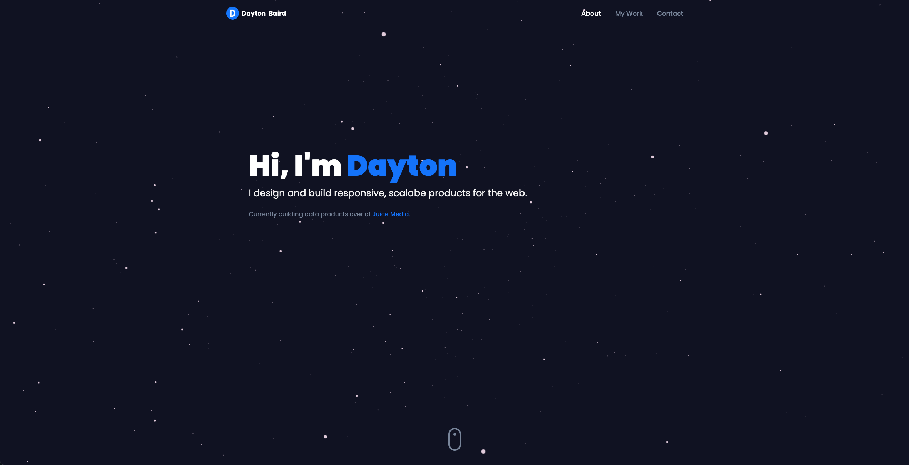

# My Personal Website - [daytonbaird.com](https://daytonbaird.com)

Built with React, Vite, TailwindCSS, Three.js, and Framer Motion.

I hacked this website togther over a weekend to learn Three.js and Framer Motion and to showcase my work.

---

# React + Vite

This template provides a minimal setup to get React working in Vite with HMR and some ESLint rules.

Currently, two official plugins are available:

- [@vitejs/plugin-react](https://github.com/vitejs/vite-plugin-react/blob/main/packages/plugin-react/README.md) uses [Babel](https://babeljs.io/) for Fast Refresh
- [@vitejs/plugin-react-swc](https://github.com/vitejs/vite-plugin-react-swc) uses [SWC](https://swc.rs/) for Fast Refresh
